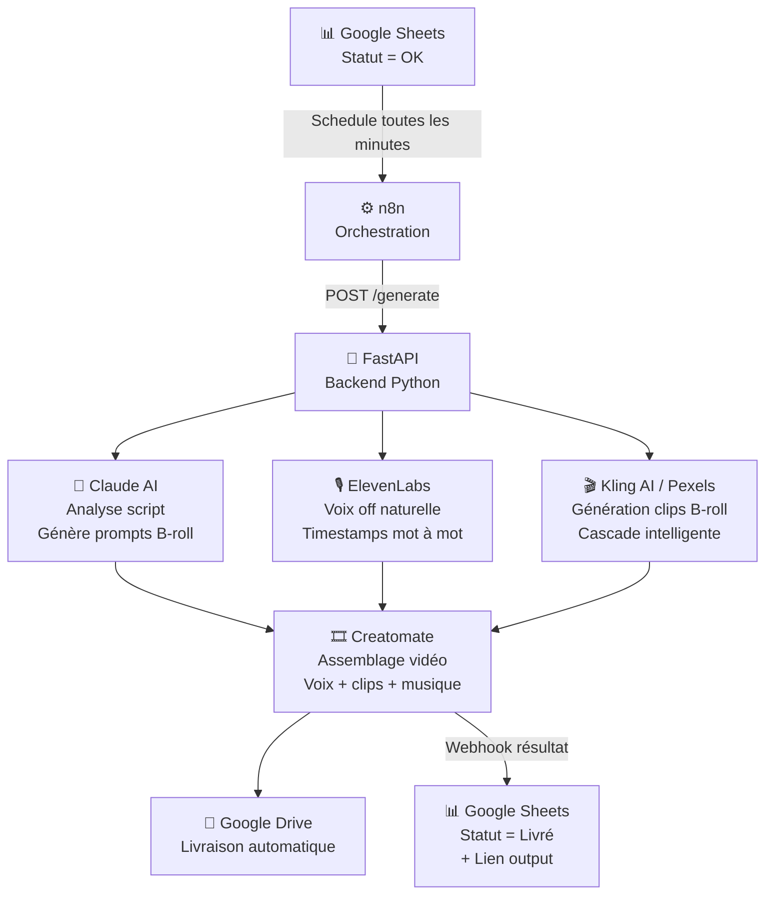

# VideoGen — Pipeline IA de génération de publicités vidéo


> Du script brut à la vidéo publicitaire livrée sur Google Drive — **sans intervention humaine**.

---

## 🔴 Le problème

Produire des publicités vidéo à la chaîne est **lent, coûteux et difficile à scaler**.

- Un monteur humain prend **2 à 4 heures** par vidéo
- Le coût de production oscille entre **150 et 500 €** par pub
- Changer de format, de voix ou de durée implique de **tout recommencer**
- Les agences et créateurs qui produisent 10, 20 ou 50 pubs par mois se heurtent à un mur opérationnel

---

## ✅ La solution

**VideoGen** est un pipeline d'automatisation qui transforme une ligne Google Sheets en une vidéo publicitaire complète en moins de 15 minutes.

L'opérateur remplit une ligne dans un tableau (script, voix, format, durée, style de sous-titres) et met le statut sur `OK`. Le reste est automatique : analyse du script, génération de la voix off, création des clips B-roll, génération des sous-titres synchronisés, assemblage et livraison.

**Résultat :** une vidéo prête à diffuser sur Google Drive avec sous-titres karaoke intégrés, tracking complet dans le Sheet.

---

## 🏗️ Architecture



**Flux en 4 étapes :**

| # | Étape | Acteur | Durée |
|---|-------|--------|-------|
| 1 | n8n détecte le statut `OK` et appelle l'API | n8n | < 1 min |
| 2 | Claude analyse le script, génère les prompts B-roll et les timings | Claude AI | ~30s |
| 3 | ElevenLabs synthétise la voix (timestamps mot à mot), Kling génère les clips B-roll | ElevenLabs + Kling | ~5–10 min |
| 4 | Génération des sous-titres synchronisés (segmentation + karaoke) | VideoGen API | < 1s |
| 5 | Creatomate assemble la vidéo finale (voix + clips + sous-titres), upload Drive, mise à jour Sheet | Creatomate | ~2 min |

---

## 🛠️ Stack technique

| Couche | Technologie | Rôle |
|--------|------------|------|
| **Backend** | Python 3.14 · FastAPI · Pydantic v2 | API REST, pipeline, queue de jobs |
| **Serveur** | Uvicorn · Gunicorn · Docker | Exécution et containerisation |
| **Proxy / Deploy** | Traefik · Coolify | HTTPS, reverse proxy, déploiement VPS |
| **Orchestration** | n8n | Workflows no-code, triggers, webhooks |
| **IA — Script** | Anthropic Claude Opus | Découpage scènes, timings, prompts B-roll |
| **IA — Voix** | ElevenLabs | Synthèse vocale + timestamps mot à mot |
| **IA — Vidéo** | Kling AI | Génération clips B-roll par prompt |
| **Stock vidéo** | Pexels API | Fallback gratuit avant Kling |
| **Assemblage** | Creatomate | Rendu vidéo final (voix + clips + musique) |
| **Stockage** | Google Drive · Google Sheets | Livraison + dashboard opérateur |
| **Monitoring** | Sentry · Dashboard HTML | Alertes prod + suivi jobs temps réel |

---

## 🎬 Demo workflow

> 📌 *Vidéo démo et screenshots à venir*

**1 — L'opérateur remplit une ligne dans le Sheet**

```
| Script                  | Statut | Format   | Voix ID           | Durée | Vitesse voix | Sous-titres |
|-------------------------|--------|----------|-------------------|-------|--------------|-------------|
| Il y a une femme qui... | OK     | vertical | tMyQcCxfGDdIt7wJ  | 70    | 1.5          | tiktok      |
```

Colonne `Sous-titres` : `tiktok` (blanc bold 7.5vmin), `classique` (blanc 5vmin + fond), ou `cinema` (blanc light 3.5vmin)

**2 — n8n détecte la ligne et lance le pipeline**

```
Schedule (1 min) → Filtre Statut OK → Update "En cours" → POST /generate
```

**3 — Le backend orchestre les APIs**

```
Claude analyse le script         →  14 scènes · 14 prompts Kling · timings précis
ElevenLabs génère la voix off    →  ~70s audio · timestamps mot à mot
Kling AI génère les clips        →  14 clips B-roll · 5s chacun · sans audio natif
Creatomate assemble la vidéo     →  70s · 9:16 · voix + B-roll + musique
```

**4 — Livraison automatique**

```
Upload Google Drive  →  Webhook n8n  →  Statut = "Livré" + lien dans le Sheet
```

⏱️ **Temps total : 8 à 15 minutes** | 💰 **Coût moyen : ~2,50 $ par vidéo** (dès le 2e mois)

---

## 📝 Sous-titres synchronisés (Karaoke style)

VideoGen génère automatiquement des **sous-titres synchronisés mot par mot** en style CapCut/TikTok.

### Architecture

```
ElevenLabs timestamps (ms)
    ↓
Segmentation DaVinci Resolve
  ├─ Découpage en phrases (gaps ≥ 400 ms)
  ├─ Limitation per ligne : 38 caractères max (Netflix = 42)
    ↓
Affichage karaoke
  ├─ Chaque mot déclenche un update
  ├─ Le texte s'accumule : "mot1" → "mot1 mot2" → "mot1 mot2 mot3"
  ├─ Les pauses naturelles = vide à l'écran
    ↓
Creatomate (Track 6)
  └─ Rendu final vidéo
```

### Configuration par style

| Style | Couleur | Taille | Poids | Position | Notes |
|-------|---------|--------|-------|----------|-------|
| **TikTok** | Blanc (#ffffff) | 7.5 vmin | 900 (ultra-bold) | 75% | Impact maximal, lisible sur n'importe quel fond |
| **Classique** | Blanc (#ffffff) | 5 vmin | 700 (bold) | 80% | Avec fond semi-transparent noir (55%) |
| **Cinéma** | Blanc (#ffffff) | 3.5 vmin | 300 (light) | 88% | Discret, élégant, effet film |

Tous les styles :
- Centré horizontalement
- Contour noir fin pour lisibilité
- Synchronisés au mot avec ElevenLabs timestamps
- Pas de background sauf Classique

### Exemple de rendu

```
t=0.0s : "Le"
t=0.3s : "Le texte"
t=0.6s : "Le texte s'accumule"
t=1.2s : "Le texte s'accumule progressivement"
t=1.5s : [pause = vide]
t=2.1s : "Chaque"
t=2.4s : "Chaque ligne"
...
```

### Configuration n8n

La colonne `O` ("Sous-titres") du Google Sheet accepte : `tiktok`, `classique`, `cinema`.

```javascript
// Expression n8n pour extraire le style
subtitle_style: $('Filtre Statut OK').item.json['Sous-titres'] 
  ? $('Filtre Statut OK').item.json['Sous-titres'].toString().toLowerCase().trim() 
  : null
```

---

## 💼 Valeur business

| Indicateur | Production humaine | VideoGen | Gain |
|-----------|-------------------|----------|------|
| Temps par vidéo | 2 à 4 heures | **8 à 15 min** | **×12 à ×20** |
| Coût par vidéo | 150 à 500 € | **~2,50 $** | **×60 à ×200** |
| Vidéos / jour (1 opérateur) | 2 à 3 | **50+** | **×20** |
| Intervention humaine | Constante | **Zéro** | — |
| Scalabilité | Linéaire (↑ coût) | **Quasi illimitée** | — |

**Break-even :** rentable dès la 2e vidéo par rapport à un monteur externalisé.

**Scalabilité :** N vidéos en file d'attente — l'opérateur remplit le Sheet, le pipeline tourne seul.

---

## 🎯 Cas d'usage

**Agences de publicité digitale**
Produire 20 à 50 variantes de pub par semaine pour des clients e-commerce sans embaucher de monteurs. Chaque pub est un script différent, même pipeline automatique.

**Créateurs de contenu & Personal branding**
Transformer des scripts générés par IA en vidéos B-roll publiables directement sur Instagram Reels, TikTok ou YouTube Shorts.

**E-commerçants & Dropshippers**
Générer des publicités produit en masse pour tester différentes accroches, populations cibles et durées — sans coût fixe de production.

**Studios de contenu vidéo**
Automatiser la production de formats récurrents (tutoriels, témoignages, UGC) et libérer les monteurs humains pour les projets à forte valeur ajoutée.

**SaaS & Startups**
Créer rapidement des vidéos de démonstration, d'onboarding ou de campagnes d'acquisition sans dépendre d'une équipe créative interne.

---

## 🚀 Déploiement

### Architecture cible

```
VPS Ubuntu 22.04+
├── Coolify (orchestration containers)
│   ├── VideoGen API  (Docker · port 8000)
│   └── n8n           (Docker · port 5678)
└── Traefik (HTTPS · reverse proxy automatique)
```

### Prérequis

- VPS Ubuntu 22.04+ — **2 Go RAM minimum** (4 Go recommandés)
- [Coolify](https://coolify.io) installé
- Clés API : [Anthropic](https://console.anthropic.com) · [ElevenLabs](https://elevenlabs.io) · [Kling AI](https://klingai.com) · [Pexels](https://www.pexels.com/api/) · [Creatomate](https://creatomate.com)
- Google Cloud : Drive + Sheets API (compte de service JSON)

### Variables d'environnement

```env
# Sécurité
API_SECRET_KEY=                    # Clé partagée n8n ↔ API

# IA
ANTHROPIC_API_KEY=
ELEVENLABS_API_KEY=
ELEVENLABS_DEFAULT_VOICE_ID=
KLING_ACCESS_KEY=
KLING_SECRET_KEY=

# Médias & Assemblage
PEXELS_API_KEY=
CREATOMATE_API_KEY=

# Google
GOOGLE_DRIVE_FOLDER_ID=
GOOGLE_SERVICE_ACCOUNT=            # JSON service account encodé en base64

# Optionnel
SENTRY_DSN=                        # Monitoring erreurs production
API_BASE_URL=                      # URL publique de l'API
```

### Lancer en local

```bash
pip install -r requirements.txt
uvicorn app.main:app --reload
# → http://localhost:8000/docs
```

### Lancer les tests

```bash
pytest tests/ -v
# 71 tests · ~10 secondes
```

### Déployer via Coolify

1. Connecter le repo GitHub à Coolify
2. Sélectionner le `Dockerfile`
3. Ajouter les variables d'environnement
4. Déployer — Traefik gère le HTTPS automatiquement

---

## 📡 Endpoints API

| Méthode | Endpoint | Description |
|---------|----------|-------------|
| `POST` | `/generate` | Lance un pipeline de génération vidéo |
| `GET` | `/status/{job_id}` | Statut temps réel d'un job |
| `GET` | `/jobs` | Liste tous les jobs en mémoire |
| `GET` | `/voices` | Catalogue des voix ElevenLabs disponibles |
| `POST` | `/test-voice-speed` | Génère 4 audios aux vitesses 1.0 / 1.2 / 1.5 / 2.0 (0 crédit Creatomate) |
| `GET` | `/review/{job_id}` | Page de review des prompts Kling avant rendu |
| `POST` | `/review/{job_id}/relaunch` | Relance le pipeline avec prompts modifiés |
| `GET` | `/monitor` | Dashboard HTML de monitoring temps réel |
| `GET` | `/docs` | Documentation Swagger interactive |

---

## 📁 Structure du projet

```
video-api/
├── app/
│   ├── main.py             # FastAPI : endpoints, pipeline, queue de jobs
│   ├── claude.py           # Analyse script → structure JSON + prompts B-roll
│   ├── elevenlabs.py       # Génération voix off + timestamps mot à mot
│   ├── kling.py            # Génération clips B-roll par prompt
│   ├── library.py          # Cascade B-roll : local → Pexels → Kling
│   ├── creatomate.py       # Assemblage vidéo finale + sous-titres
│   ├── subtitles.py        # Génération sous-titres karaoke (DaVinci Resolve + CapCut)
│   ├── script_parser.py    # Parser format script PLAN N — 0:00 — 0:05
│   ├── review.py           # Page review + relaunch des prompts Kling
│   ├── voice_test.py       # Endpoint test vitesse voix (audio uniquement)
│   ├── models.py           # Schémas Pydantic (+ SubtitleStyle enum)
│   ├── config.py           # Configuration centralisée
│   └── errors.py           # Gestion d'erreurs unifiée
├── tests/                  # 71 tests pytest
├── n8n/
│   ├── LANCEMENT TACHES v2.json    # Workflow déclencheur (Schedule → API)
│   ├── FINALISATION.json           # Workflow résultat (Webhook → Sheets)
│   └── TEST VITESSE VOIX.json      # Test vitesse voix autonome (sans nous)
├── docs/
│   ├── deployment.md               # Guide déploiement VPS complet
│   ├── n8n-setup.md                # Configuration workflows n8n
│   └── guide-client.md             # Manuel d'utilisation opérateur
├── Dockerfile
├── gunicorn.conf.py
└── pyproject.toml
```

---

## 📄 Licence

Projet privé — tous droits réservés.
